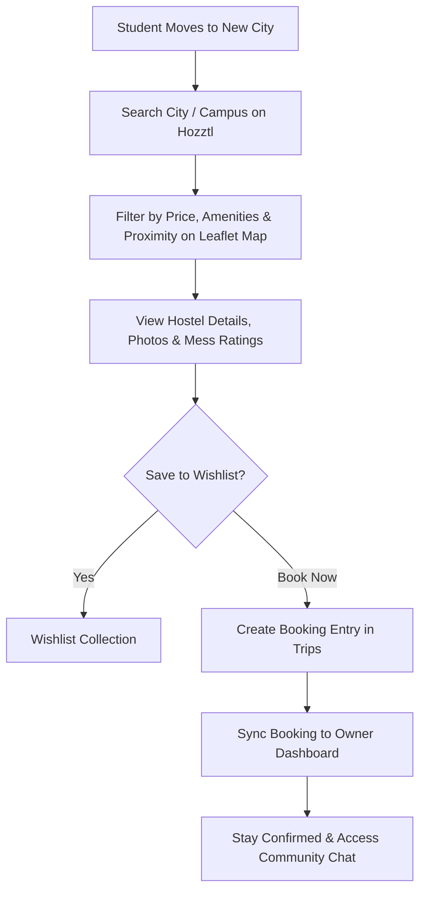
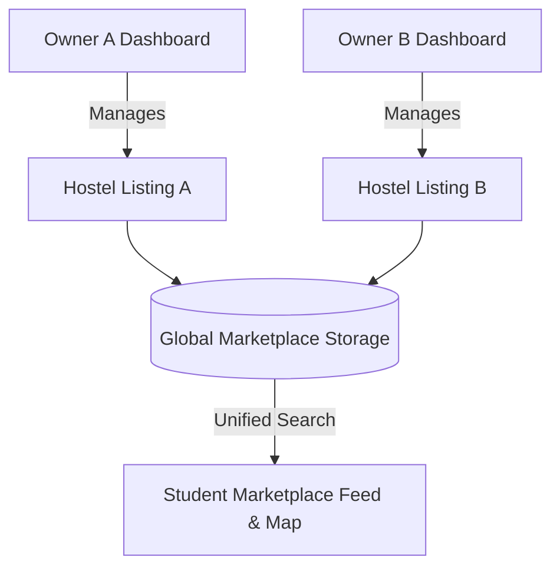
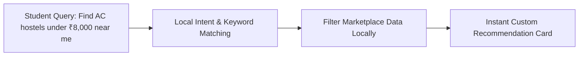

# 🏠 HOZZTL — Airbnb for Hostels & PGs

> **Student-first marketplace & discovery platform for finding, comparing, and booking verified hostels and PGs in new cities.**


---

> [!IMPORTANT]
> **READ THIS FIRST — CRITICAL PRODUCT VISION & GUARDRAILS**
> - **The Model for Hostels:** Hozztl is a two-sided marketplace connecting relocating students directly with verified hostel and PG owners.
> - **Zero-Broker Friction:** Removes middlemen, hidden broker commissions, and misleading physical visits by providing transparent pricing, verified amenity tags, and accurate location mapping.
> - **End-to-End Housing Lifecycle:** Extends beyond initial search — supporting students post-booking with community resident chat, daily mess ratings, maintenance requests, and digital leave logs.
> - **Privacy-First AI Concierge:** Built-in client-side assistant that helps students calculate budgets, check vacancy, and find suitable accommodations with zero external API fees and zero latency.

---

## 🌟 1. Overview & The Student Relocation Thesis

Every academic quarter, millions of students relocate to education hubs (such as Kota, Bengaluru, Delhi, Pune, Hyderabad, and Chennai) to pursue higher education or competitive exams. 

However, finding suitable accommodation in an unfamiliar city is stressful, unorganized, and plagued by:
- High brokerage fees and unverified broker listings.
- Misleading photographs and hidden maintenance/utility charges.
- Lack of transparent reviews regarding mess food quality and safety.
- Distance mismatch between hostels and colleges/coaching institutes.

**Hozztl** solves student relocation by bringing **seamless discovery, map search, instant booking, and transparent reviews** to the hostel and PG ecosystem.

> **The Relocation Thesis:** *Finding a home in a new city shouldn't feel like a gamble. We turn room hunting into a 5-minute visual exploration and connect students directly to verified property owners.*

---

## ❗ 2. The Problem Statement

| Relocation Friction | Current Reality | The Hozztl Marketplace Solution |
|---|---|---|
| **Hostel Discovery** | Relying on local brokers & physical door-to-door visits | Interactive Leaflet map & location-based search near colleges |
| **Trust & Transparency** | Fake photos & undisclosed extra charges | Verified photo galleries, transparent pricing, & amenity badges |
| **Booking Assurance** | Verbal promises & unrecorded cash advances | Digital booking engine ("Trips") with instant confirmation |
| **Food & Living Quality** | No way to know mess quality before moving in | Authentic student reviews and daily dish-by-dish meal ratings |
| **Community Connection** | Moving to a new city alone without contacts | Internal hostel community chat to connect with future roommates |

---

## 💡 3. Five Contrarian Product Choices

1. **Clean Discovery Engine for Student Housing:** Designed specifically for student priorities — filtering by proximity to institutions, gender categories (Boys/Girls/Co-ed), AC/Non-AC, food inclusion, and Wi-Fi speed.
2. **Beyond Search: Post-Booking Living Suite:** Unlike standard room-listing directories that disappear after booking, Hozztl transitions into the resident's daily portal for mess menu tracking, complaint filing, and community updates.
3. **Multi-Owner Marketplace Isolation:** Independent property owners can list their hostels, manage room inventories, and track revenues without cross-owner data exposure.
4. **Local Zero-Latency AI Search Concierge:** An embedded client-side agent (`AgentControlPlane`) that assists students in narrowing down hostels by budget, room preference, and location without expensive cloud AI latency.
5. **Verified Peer Community & Chat:** Resident-only internal chat rooms that foster community among students living in the same hostel without sharing personal contact numbers.

---

## 🎯 4. Core Marketplace Surfaces

### 🎒 Student Marketplace Surfaces
| Surface Name | Primary Purpose |
|---|---|
| **Explore Hub** | Airbnb-style search bar, category pills (Luxury, Budget, Near Campus), and hostel cards |
| **Interactive Map View** | Leaflet-powered geospatial search showing hostel pins near educational hubs |
| **Hostel Detail View** | Comprehensive page featuring high-res imagery, room tariffs, amenity badges, and map coordinates |
| **Wishlists & Favorites** | Save and compare preferred hostels before making a final booking decision |
| **Trips & Bookings Manager** | Active stay itineraries, check-in/out dates, booking status updates, and cancellation controls |
| **Community Chat** | Real-time messaging with co-residents of the booked hostel |
| **AI Relocation Assistant** | Local conversational assistant for instant vacancy checks, FAQ resolution, and budget advice |

### 🏠 Host / Owner Surfaces
| Surface Name | Primary Purpose |
|---|---|
| **Hostel Listing Portal** | Add new property listings with images, location, room types, pricing, and amenities |
| **Occupancy & Inventory Manager** | Real-time room allocation grid, occupied beds, and available vacancy toggles |
| **Mess & Menu Manager** | Publish daily breakfast, lunch, and dinner menus and review student ratings |
| **Grievance Resolution Desk** | Track, assign, and resolve maintenance complaints submitted by residents |
| **Notice & Broadcast Center** | Send instant announcements to all booked residents |

---

## 🧠 5. Architecture & Marketplace Workflows

### (a) Student Discovery & Booking Flow


### (b) Marketplace Data Isolation Architecture


### (c) Local AI Relocation Concierge


---

## ⚙️ 6. Tech Stack & Engine

| Layer | Technology | Purpose & Role |
|---|---|---|
| **Marketplace Web App** | React 18 + Vite 5 + TypeScript | Lightning-fast SPA with client-side routing & URL state sync |
| **Styling & UI Systems** | Tailwind CSS + Radix UI + shadcn/ui | Airbnb-inspired modern aesthetics, responsive drawer menus, and dialogs |
| **Geospatial Engine** | Leaflet + `@types/leaflet` | Interactive map interface for locating hostels near student hubs |
| **Database & Auth** | Supabase PostgreSQL + Auth | Secure JWT authentication, Row-Level Security (RLS), & realtime DB |
| **Local AI Concierge** | Custom State Machine (`src/agent/`) | Zero-cost client-side assistant for student discovery and FAQs |
| **State & Storage** | React Context + LocalStorage Sync | Persistent bookmarks, favorites, bookings ("Trips"), and owner state |

---

## 📂 7. Project Structure

```text
HostelMate/
 ├── public/                  [Static assets, logo & map markers]
 ├── src/
 │    ├── agent/              [Local AI concierge rules & skills]
 │    │    ├── skills.json
 │    │    └── system_rules.md
 │    ├── components/         [Marketplace & Owner components]
 │    │    ├── AgentControlPlane.tsx    [AI relocation assistant]
 │    │    ├── BottomNav.tsx            [Airbnb-style mobile navigation bar]
 │    │    ├── CommunityChat.tsx        [Resident chat hub]
 │    │    ├── ComplaintForm.tsx        [Post-booking maintenance portal]
 │    │    ├── HostelCard.tsx           [Hostel preview card with pricing & rating]
 │    │    ├── HostelDetail.tsx         [Rich hostel landing page with booking CTA]
 │    │    ├── HostelMap.tsx            [Leaflet interactive search map]
 │    │    ├── LoginPage.tsx            [Student & Owner login modals]
 │    │    ├── MessRatingWidget.tsx     [Daily mess meal rating widget]
 │    │    ├── MessagesPage.tsx         [Student messaging dashboard]
 │    │    ├── OwnerPage.tsx            [Hostel owner listing & management portal]
 │    │    ├── ProfilePage.tsx          [Student user account & settings]
 │    │    ├── RoleSelectPage.tsx       [Student vs. Host landing selector]
 │    │    ├── StudentPage.tsx          [Main Marketplace Explore Feed & Filters]
 │    │    ├── TripsPage.tsx            [Student booked stays & itineraries]
 │    │    ├── WishlistsPage.tsx        [Saved hostels collection]
 │    │    └── ui/                  [shadcn/ui base primitives]
 │    ├── context/            [AuthContext & HostelContext providers]
 │    ├── data/               [Mock hostel marketplace listings & fallback data]
 │    ├── pages/              [Main Index.tsx router & state orchestrator]
 │    └── types/              [Hostel, Booking, & User TypeScript types]
 ├── supabase/                [Database migrations & Supabase configuration]
 ├── package.json
 ├── tailwind.config.ts
 └── README.md
```

---

## 🔮 8. Future Scope & Roadmap

- [ ] **College Proximity Distance Matrix:** Instant distance & commute time calculation to nearby universities and coaching centers.
- [ ] **Virtual 360° Room Tours:** Immersive room previews to inspect bed space, study desks, and washrooms remotely.
- [ ] **Roommate Matching Engine:** AI-assisted roommate preference matching based on sleep schedules and study habits.
- [ ] **Online Rent & Token Deposit Payments:** Integrated UPI/card payment gateway for securing bookings instantly.
- [ ] **Verified Student Badging:** Student ID verification for hostellers to ensure safety and trust across listings.

---


## 🚀 9. Installation & Local Setup

### Prerequisites
- Node.js (v18.0.0 or higher)
- npm or bun package manager

### Step-by-Step Setup

1. **Clone the Repository:**
   ```bash
   git clone https://github.com/axhayco/HostelMate.git
   cd HostelMate
   ```

2. **Install Dependencies:**
   ```bash
   npm install
   ```

3. **Configure Environment Variables:**
   Create a `.env` file in the root directory (refer to `.env.example`):
   ```env
   VITE_SUPABASE_URL=your_supabase_project_url
   VITE_SUPABASE_ANON_KEY=your_supabase_anon_key
   ```

4. **Start the Development Server:**
   ```bash
   npm run dev
   ```
   Open `http://localhost:5173` in your browser.

5. **Run Tests & Validation:**
   ```bash
   npm run test
   npm run lint
   ```

---


## 🏆 10. Vision

> *Hozztl is building the future of student housing relocation. By bringing Airbnb-like transparency, interactive map discovery, and direct owner connections to hostels and PGs, we make moving to a new city safe, effortless, and empowering for every student.*

---

*Built with ❤️ for student housing & relocation innovation.*
