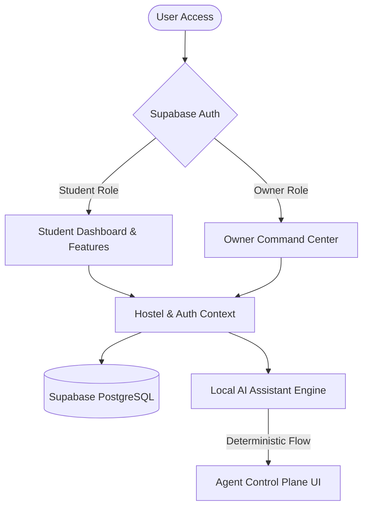
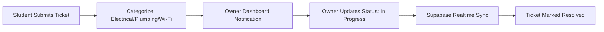
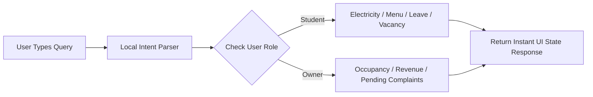

# 🏠 HOSTELMATE — smart hostel living & seamless owner management

> **Dual-interface, AI-assisted hostel & PG management platform powered by deterministic intelligence and real-time backend synchronization.**


---

> [!IMPORTANT]
> **READ THIS FIRST — CRITICAL GUARDRAILS & ARCHITECTURE**
> - **Dual-Role RBAC:** HostelMate features role-based access control (Student vs. Hostel Owner) seamlessly integrated with Supabase Authentication and PostgreSQL Row-Level Security (RLS).
> - **Privacy-First Local AI Agent:** The embedded HostelMate Digital Assistant operates 100% client-side with a deterministic state machine. No external API key dependencies, zero network latency, and zero token costs.
> - **Actionable Feedback Loop:** Daily meal ratings and complaint management systems bridge student grievances directly to owner action dashboards.
> - **Geospatial Discovery:** Interactive map support powered by Leaflet allows students to discover hostels by proximity, budget, and verified amenities.

---

## 🌟 1. Overview & The Operating Thesis

**HostelMate** bridges the operational gap between hostel residents and accommodation owners. In traditional hostel management, students face unresolved maintenance complaints, unmonitored meal quality, and opaque billing. Meanwhile, hostel owners struggle with manual rent tracking, room vacancy management, and disorganized communication channels.

HostelMate closes this gap with an intuitive dual-interface web application supported by an instant, zero-latency local AI digital assistant.

> **The Operating Thesis:** *We replaced fragmented chat groups and paper registers with an integrated real-time engine, and replaced expensive cloud LLMs with a fast, deterministic client-side assistant.*

---

## ❗ 2. The Problem Statement

| Operational Challenge | Traditional Method | HostelMate Solution |
|---|---|---|
| **Complaint Resolution** | Paper registers & lost WhatsApp messages | Ticket tracking with status updates & priority flags |
| **Mess Quality Control** | Verbal complaints ignored by management | Daily dish-by-dish ratings with owner analytics |
| **Room Allocation** | Manual logbooks & double-booking risks | Real-time vacancy updates and instant booking requests |
| **Student Support** | Delayed response from busy wardens | 24/7 local AI assistant for instant FAQs & status checks |
| **Rent & Utilities** | Physical receipts & manual meter tracking | Digital bill calculation & electricity unit tracking |

---

## 💡 3. Five Contrarian Product Choices

1. **Local Deterministic AI Assistant:** Operating entirely on client-side state machines without requiring external LLM API keys. It delivers 100% reproducible answers for queries like electricity balance, leave status, and mess menus instantly.
2. **Unified Dual-Role Codebase:** A single responsive Web App serving both student convenience and owner administrative power seamlessly through context-aware routing.
3. **Dish-Level Daily Mess Ratings:** Rather than generic 5-star reviews, students rate individual meals (Breakfast, Lunch, Dinner), providing actionable feedback to mess managers.
4. **Interactive Geospatial Search:** Integrated Leaflet map views with instant amenity filtering (Wi-Fi, AC, Laundry, Security) to make hostel hunting visual and transparent.
5. **Privacy-Conscious Community Hub:** Internal hostel chat channels that enable student interaction and announcements without exposing personal phone numbers.

---

## 🎯 4. Core Surfaces

### 👨🎓 Student Surfaces
| Surface Name | Primary Purpose |
|---|---|
| **Student Dashboard** | Central hub showing current hostel status, room info, quick actions, and news |
| **Hostel Discovery & Map** | Filterable list and Leaflet map view for finding and comparing hostels |
| **Mess & Meal Rating** | Daily meal menu view with dish-level rating and feedback submitter |
| **Complaint Portal** | Form for submitting maintenance tickets (Plumbing, Electrical, Wi-Fi) with photo attachments |
| **Trips & Bookings** | Active booking manager and upcoming stay itinerary |
| **Community Chat** | Moderated resident chat room for notices and peer discussions |
| **Digital Assistant** | Floating AI agent for instant queries, leave application, and utility checks |

### 🏢 Owner Surfaces
| Surface Name | Primary Purpose |
|---|---|
| **Owner Command Center** | High-level metrics for total revenue, occupancy rate, and active complaints |
| **Occupancy & Room Manager** | Room allocation grid, tenant directory, and vacancy toggles |
| **Mess Dashboard** | Menu planner, meal quality analytics, and student rating breakdown |
| **Complaints Management** | Kanban/list dashboard to assign, resolve, and prioritize resident tickets |
| **Broadcast & Announcements** | Notice creator to send instant announcements to all residents |

---

## 🧠 5. Architecture & Workflows

### (a) System Architecture Flow


### (b) Maintenance Complaint Lifecycle


### (c) Local AI Assistant Intent Engine


---

## ⚙️ 6. Tech Stack & Engine

| Layer | Technology | Purpose & Role |
|---|---|---|
| **Frontend Framework** | React 18 + Vite 5 | Fast SPA runtime and HMR build environment |
| **Language** | TypeScript 5 | Strict type-safety across components and data models |
| **Styling & UI** | Tailwind CSS + Radix UI | Modern responsive design with accessible primitive components |
| **Component Library** | shadcn/ui + Lucide Icons | Premium aesthetic typography, dialogs, drawers, and icons |
| **Database & Auth** | Supabase | PostgreSQL database, Row Level Security (RLS), and JWT Auth |
| **Maps & Analytics** | Leaflet + Recharts | Interactive map view and dashboard data visualization |
| **Local AI Engine** | Custom State Machine (`src/agent/`) | Zero-cost deterministic conversational AI agent |
| **State & Forms** | TanStack Query + React Hook Form + Zod | Data fetching, form state management, and schema validation |

---

## 📂 7. Project Structure

```text
HostelMate/
 ├── public/                  [Static assets & favicon]
 ├── src/
 │    ├── agent/              [Local AI engine rules & skills definitions]
 │    │    ├── skills.json
 │    │    └── system_rules.md
 │    ├── components/         [Application components]
 │    │    ├── AgentControlPlane.tsx    [Local AI Assistant shell]
 │    │    ├── CommunityChat.tsx        [Resident chat hub]
 │    │    ├── ComplaintForm.tsx        [Maintenance ticket submission]
 │    │    ├── HostelCard.tsx           [Hostel preview card]
 │    │    ├── HostelDetail.tsx         [Detailed hostel view & booking]
 │    │    ├── HostelMap.tsx            [Leaflet interactive map]
 │    │    ├── LoginPage.tsx            [Authentication & role login]
 │    │    ├── MessRatingWidget.tsx     [Student mess rating interface]
 │    │    ├── OwnerComplaintsDashboard.tsx [Owner ticket management]
 │    │    ├── OwnerMessDashboard.tsx   [Owner menu planner & ratings]
 │    │    ├── OwnerPage.tsx            [Owner command center]
 │    │    ├── ProfilePage.tsx          [User profile & settings]
 │    │    ├── StudentPage.tsx          [Student main dashboard]
 │    │    └── ui/                  [Radix UI / shadcn base components]
 │    ├── context/            [React Context providers: Auth & Hostel]
 │    ├── hooks/              [Custom React hooks]
 │    ├── lib/                [Utilities, utils.ts, Supabase client]
 │    ├── pages/              [Main route views]
 │    └── types/              [TypeScript interface definitions]
 ├── supabase/                [Supabase config & database migrations]
 ├── package.json
 ├── tailwind.config.ts
 ├── vite.config.ts
 └── README.md
```

---

## 🔮 8. Future Scope & Roadmap

- [ ] **IoT Smart Meter Integration:** Automatic meter reading sync for individual room electricity tracking.
- [ ] **Automated UPI Payment Gateway:** Integrated rent and utility bill payment flows with instant digital receipts.
- [ ] **Voice-Assisted Complaint Filing:** Speech-to-Text integration for quick maintenance reporting.
- [ ] **Multi-Property Owner Chain Dashboard:** Centralized management for owners operating multiple hostels across locations.
- [ ] **Gate Pass & Visitor Management:** Digital QR-code based entry/exit approval for hostellers.

---

## 👥 9. Team Responsibilities

| Role | Responsibility | Member |
|---|---|---|
| **Product & Full-Stack Lead** | Core application architecture, Supabase integration, & UI design | [Your Name] |
| **Frontend & UI Lead** | React components, Radix UI layout, & responsive styling | [Team Member] |
| **AI & Workflow Lead** | Local AI Agent Control Plane & deterministic skill state machine | [Team Member] |
| **Database & Security Lead** | Supabase schemas, RLS policies, & authentication flows | [Team Member] |

---

## 🚀 10. Installation & Local Setup

### Prerequisites
- Node.js (v18.0.0 or higher)
- npm or bun package manager

### Step-by-Step Setup

1. **Clone the Repository:**
   ```bash
   git clone https://github.com/axhayco/HostelMate.git
   cd HostelMate
   ```

2. **Install Dependencies:**
   ```bash
   npm install
   ```

3. **Configure Environment Variables:**
   Create a `.env` file in the root directory (refer to `.env.example`):
   ```env
   VITE_SUPABASE_URL=your_supabase_project_url
   VITE_SUPABASE_ANON_KEY=your_supabase_anon_key
   ```

4. **Start the Development Server:**
   ```bash
   npm run dev
   ```
   Open `http://localhost:5173` in your browser.

5. **Run Tests & Linting:**
   ```bash
   npm run test
   npm run lint
   ```

---

## 📸 11. Screen Previews

- **Student Dashboard:** `[Replace with capture of Student Dashboard]`
- **Hostel Discovery Map:** `[Replace with capture of Leaflet Map View]`
- **Owner Command Center:** `[Replace with capture of Owner Dashboard]`
- **Mess Rating Widget:** `[Replace with capture of Mess Rating Interface]`
- **AI Digital Assistant:** `[Replace with capture of Agent Control Plane]`

---

## 🏆 12. Vision

> *HostelMate turns chaotic accommodation management into a seamless, modern experience. By placing student convenience and owner clarity on equal footing, we make hostel living feel like home.*

---

*Built with ❤️ for student housing innovation.*

